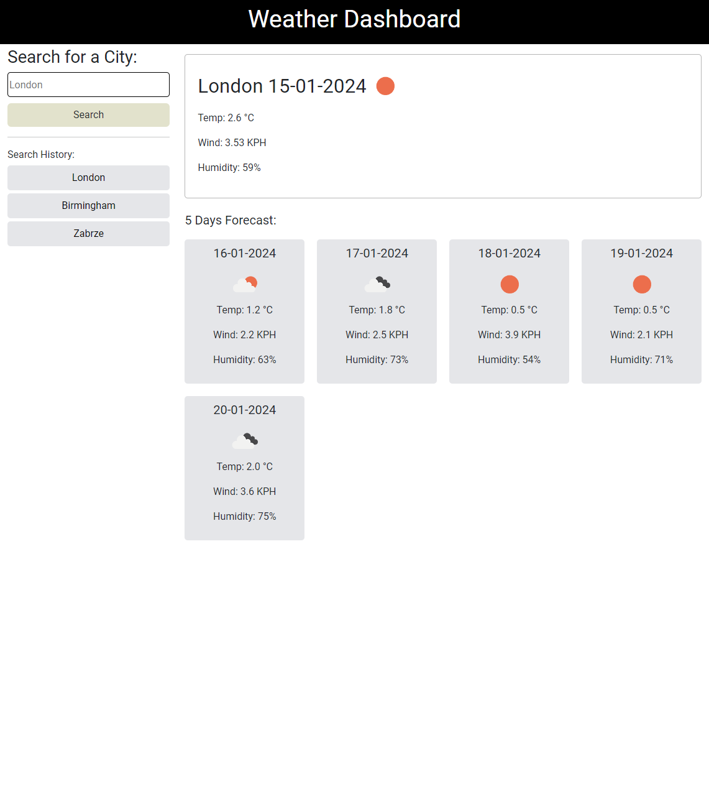

# Location-weather-app

## Description

This is a simple weather forecast application that allows users to search for the current weather and 5-day forecast for any city.

## Features

- Search for any city to get the current weather and 5-day forecast.
- Weather data includes temperature, humidity and wind speed.
- Search history feature that allows users to quickly access their previously searched cities.

## Technologies Used

- HTML
- CSS
- JavaScript
- jQuery
- OpenWeatherMap API

## Screenshot

Link to the website: https://michaltrostowiecki.github.io/location-weather-app/

## Credits 

N/A

## Licence

This project is licensed under the MIT License - see the [LICENSE](LICENSE) file for details.